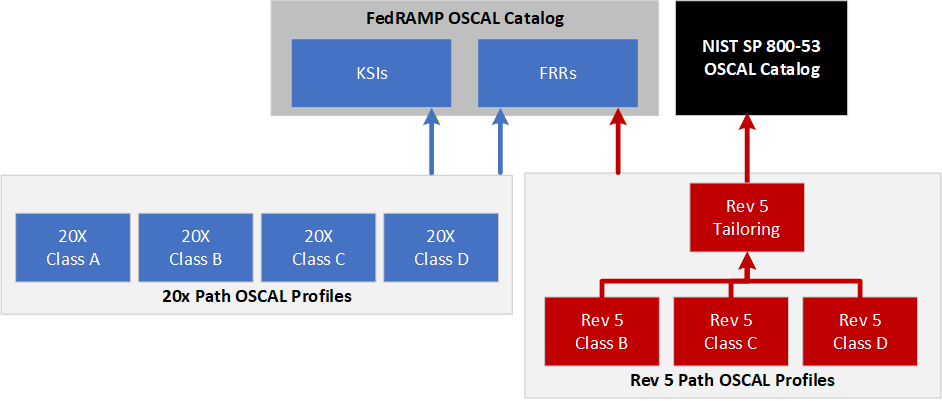

# FedRAMP Rules (FRR) to OSCAL

This parses the JSON file published by FedRAMP containing the FedRAMP Rules and associated content. It creates an OSCAL Catalog with the FedRAMP Rules and FedRAMP Profiles for 20x Class A, B, C and D as well as Rev 5 Class B, C and D. (FedRAMP does not make Class A available under the Rev 5 path.) A Rev 5 Tailoring profile is also produced; the Rev 5 class profiles import it rather than the NIST catalog directly.



## WORK IN PROGRESS  

The above description describes the target state. It is a work in progress.

### Working
- Creates a valid OSCAL Catalog with the FedRAMP Rules
- Includes opinionated translation of some content to OSCAL
- Generates 20X class profiles (A, B, C, D) and Rev 5 class profiles (B, C, D)
- Generates a Rev 5 Tailoring profile with CTL-derived set-parameters and guidance

### Up Next

- Additional refinement of the FRR -> OSCAL content
- Quality review and revisions

### Roadmap

- Refinement of Class D content when provided by the FedRAMP PMO

## Data Folder Layout

```
data/
├── raw/            Source JSON files (downloaded and cached here on first run)
│   ├── fedramp-consolidated-rules.json
│   └── NIST_SP-800-53_rev5_catalog.json
├── schemas/        JSON schemas for FedRAMP rule and document types
├── interim/        Intermediate outputs produced during a run
│   ├── index.txt
│   └── unhandled.json
├── OSCAL/          Generated OSCAL catalog and profile files
│   ├── FedRAMP_2026_OSCAL_catalog.{json,xml,yaml}
│   ├── FedRAMP_2026_OSCAL_profile_20X-{A,B,C,D}.{json,xml,yaml}
│   ├── FedRAMP_2026_OSCAL_profile_Rev5-{B,C,D}.{json,xml,yaml}
│   └── FedRAMP_2026_OSCAL_profile_Rev5-Tailoring.{json,xml,yaml}
└── scenarios/      Example CPO and SDR scenario files
```
